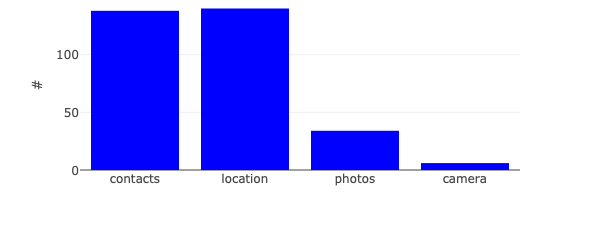
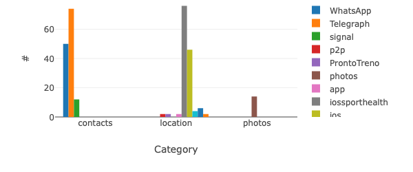
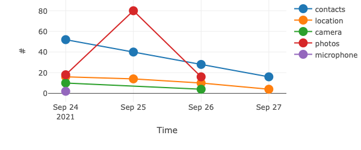

# Welcome to the AppPrivacy report reader

## Get the Report file
On [iOS15](https://www.apple.com/ios/ios-15/features/) there is a new functionality to spy
    apps that are sying on you: [AppPrivacyReport](https://www.apple.com/newsroom/2021/06/apple-advances-its-privacy-leadership-with-ios-15-ipados-15-macos-monterey-and-watchos-8/).

The goal of this repo is to have a easy to read representation.

Apple may release something similar in the future, but there was not feature to [**visualize** the data at launch](https://www.macrumors.com/guide/ios-15-delayed-features/#app_privacy_report)

### Privacy friendly
All the computation are made offline and no data is stored anywhere else than your computer. All the code is and will always be open-source.

### Export your report

Please, follow this instructions to [export](https://developer.apple.com/documentation/ios-ipados-release-notes/ios-ipados-15-release-notes#Privacy) your report:

- Settings
- Privacy
- Record App Activity (Enable it if it is diabled)
- Save App Activity

Save your report *.njson* file somewhere and upload it on the [*index.html*](index.html) page.

### Visualise the data

Simply clone this repository and open the index.html file with yout favourite browser.

# Examples

# License
See [LICENSE](LICENSE)